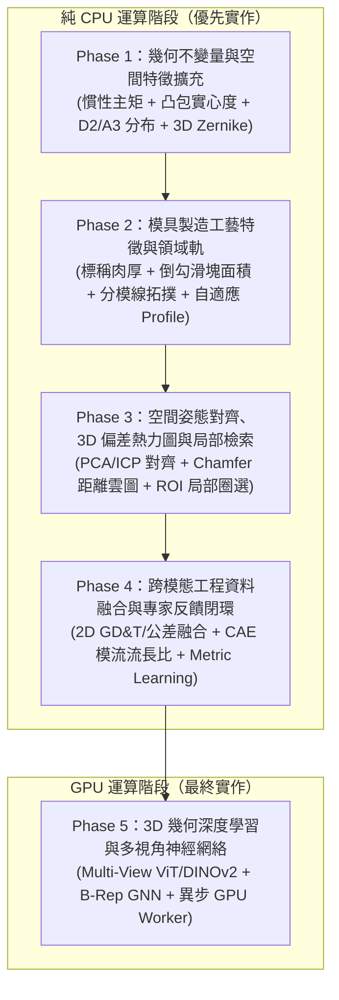

# 18 — CAD 相似度比對引擎進階優化需求規格書 (SRS)

版本：1.0 Draft  
日期：2026-09-04  
狀態：Approved for Planning  
適用範圍：Mold AI Platform（Web、Platform API、CAD Processing、Vector Store、Similarity Engine）

---

## 1. 文件目的與總體目標

本規格書針對 Mold AI Platform 目前 Stage 3 實作的 CAD 相似度比對模組進行深度重構與演進規劃。

### 1.1 現況痛點
現有 Stage 3 採用的 12 維特徵向量（包圍盒長寬高比、實體填充率、邊面數量、表面類型粗分佈）雖具備基礎形狀區分能力，但在模具製造實務上存在顯著瓶頸：
1. **質量分佈盲區**：無法區分外接盒相同但內部質量分佈迥異的形體（例如工字樑 vs. L型支架）。
2. **缺乏成型工藝語意**：無法量化模具工程師最關切的「標稱肉厚」、「脫模倒勾區域（滑塊/斜銷需求）」與「分模線複雜度」。
3. **無空間對齊與差異可視化**：兩圖比對僅輸出抽象分數，無法疊合並呈現局部尺寸公差與形體偏差。
4. **權重固定未適應產品類別**：薄壁外殼件與精密連接器共用單一打分權重，導致比對結果脫離工程直覺。

### 1.2 總體演進策略（先 CPU 後 GPU 原則）
嚴格落實**「非 GPU 項目優先落地、GPU 深度學習項目最後實施」**的策略：
* **前四階段（Phase 1 ~ Phase 4）**：全面採用純 CPU 幾何拓撲算法（OpenCASCADE、Trimesh、Numpy、Scipy、Three.js、Qdrant），無需購買或掛載專用 GPU 即可實現高精準度、可解釋、具備模具專業語意的比對。
* **最終階段（Phase 5）**：引入需要 GPU 的深度幾何表徵（多視角視覺嵌入、B-Rep GNN），並將運算解耦至專用 GPU Worker 隊列，不影響日常 Web API 運行。

---

## 2. 分階段實施藍圖（Phase Breakdown）



---

## 3. 各階段詳細需求規格

### 3.1 Phase 1：幾何不變量與空間特徵擴充（免 GPU）

#### 3.1.1 業務與工程目標
擴展特徵向量空間，從 12 維升級至 **32 維旋轉不變幾何指紋**，徹底解決「外接盒相同但形狀實質不同」的低級誤判。

#### 3.1.2 功能需求清單
1. **慣性主矩（Principal Moments of Inertia, PMI）特徵**：
   * 在 [`cad_processing.py`](file:///c:/project/Mold-AI-Platform/services/platform-api/platform_core/cad_processing.py) 中計算實體相對於質心（Center of Mass）的三軸慣性張量主值 ($I_1 \ge I_2 \ge I_3$)。
   * 提煉特徵：主慣性比 $I_2/I_1, I_3/I_1$，以及正規化旋轉半徑（Radius of Gyration）。
2. **凸包實心度與凹陷度（Solidity & Convexity）**：
   * 計算實體凸包（Convex Hull），輸出體積比率 $\text{Solidity} = V_{\text{mesh}} / V_{\text{hull}}$。
   * 輸出表面凹凸比 $\text{Convexity} = A_{\text{hull}} / A_{\text{mesh}}$。
3. **D2 形狀分佈直方圖（D2 Shape Distribution）**：
   * 在網格表面依面積權重均勻採樣 4,096 點，計算隨機點對間的歐氏距離，生成 8 區間歸一化直方圖。
4. **低階 3D 澤尼克矩（3D Zernike Moments）**：
   * 在 CPU 端透過體素化採樣，計算階數 $n \le 4$ 的 3D 澤尼克正交不變量（提供極佳的空間凹凸分佈描述能力，具旋轉不變性）。
5. **向量資料庫架構升級與遷移策略**：
   * 新建獨立 Qdrant Collection `cad-similarity-v2`（32 維 Cosine），版本標記為 `index_version: "2.0-geom32"`，與舊版 `cad-similarity-v1`（12 維）**並行運作**。
   * **遷移流程**：
     1. 部署新版 `extract_feature_set()` 後，所有新上傳的 CAD 自動寫入 v2 Collection。
     2. 提供一次性批量遷移腳本 `scripts/migrate_feature_index_v2.py`，對所有現存 `FeatureSet` 記錄重新計算 32 維向量並索引至 v2。
     3. 遷移期間檢索邏輯採用**雙 Collection 讀取**：同時查詢 v1 與 v2，以 `coarse_score` 統一排序後合併候選名單。
     4. 遷移完成且驗證通過後，將 `QDRANT_CAD_COLLECTION` 環境變數切換至 v2，移除雙讀邏輯，歸檔 v1 Collection。
   * **版本共存策略**：`FeatureSet` 模型透過 `schema_version="2.0"` 與 `extractor_version="2.0.0"` 區分新舊版本，利用現有 `unique_cad_feature_set_version` 約束自然共存。`compare_feature_sets()` 在遇到新舊版本混合比對時，僅比對兩者共有的特徵欄位子集（降級至 v1 的 4 軌評分）。

#### 3.1.3 交付與驗收指標
* 單一模型特徵萃取 CPU 時間增加不超過 350ms。
* 對 L型、工字型、環形零件的比對準確度顯著提升，不再出現誤判為同形體的案例。

---

### 3.2 Phase 2：模具製造工藝特徵與領域打分軌（免 GPU）

#### 3.2.1 業務與工程目標
將「模具製造可行性」與「成型工藝語意」納入相似度比對核心，使推薦結果具備實質開模參考價值。

#### 3.2.2 功能需求清單
1. **標稱壁厚與分佈（Nominal Wall Thickness & Uniformity）**：
   * 利用射線法（Ray-casting）結合法向量，採樣模型內壁厚度分佈。
   * 輸出特徵：標稱壁厚中位數（Nominal Thickness）、最大壁厚比（厚薄比）、壁厚變異係數（Wall Variance）。
2. **主脫模方向倒勾分析（Undercut & Slide Complexity）**：
   * 自動估計主開模方向（預設 $\pm Z$ 軸，或依最大投影面自動判定）。
   * 識別無法沿開模方向脫模的幾何陰影面（Undercuts），計算倒勾總投影面積與預估側抽芯（Slide / Lifter）數量。
3. **分模線與分模面特徵（Parting Line / Surface Classification）**：
   * 萃取最大輪廓外周分模線，分類為：`FLAT_PLANE`（平面分模）、`STEPPED`（階梯分模）、`3D_SURFACE`（空間曲面分模）。
4. **STL 格式降級處理策略**：
   * STL 為純三角網格，不具備 B-Rep 拓撲資訊，無法精確計算壁厚、倒勾與分模線。
   * **降級規則**：STL 檔案的 `manufacturing` 軌自動標記為 `NOT_AVAILABLE`，依現有的動態權重重新歸一化機制自動排除該軌（其餘可用軌等比例放大權重）。
   * **可選近似估算**：提供基於體素化距離變換（Voxelized Distance Transform）的 STL 壁厚近似值，但精確度標記為 `APPROXIMATE`，僅供參考排序。
4. **重排引擎（Reranking）新增「製造工藝軌（Manufacturing Lane）」**：
   * 擴充重排評分權重結構，將評分軌劃分為 5 軌：
     * `geometry` (幾何形狀, 25%)
     * `dimension` (絕對尺寸, 20%)
     * `manufacturing` (製造工藝: 壁厚/倒勾/分模, 25%)
     * `topology` (拓撲特徵, 20%)
     * `metadata` (材料/產品, 10%)
5. **產品線自適應 Profile（Family-Specific Profiles）**：
   * 系統提供多組預設權重 Profile：
     * `housing_standard`（外殼類：強化分模線與倒勾權重）
     * `precision_connector`（連接器：強化絕對尺寸與微結構權重）
     * `optical_lens`（光學件：強化表面曲率與壁厚均勻度權重）

#### 3.2.3 交付與驗收指標
* 能精確辨識出需要滑塊（Slide）與純對開模具的差異。
* 輸出證據鏈中包含：`"Similar undercut count (2 slides required)"` 或 `"Parting line is planar on both parts"`。

---

### 3.3 Phase 3：空間姿態對齊、3D 偏差熱力圖與局部檢索（免 GPU）

#### 3.3.1 業務與工程目標
告別單純「看百分比分數」的黑盒體驗，提供工程師視覺化的 3D 幾何差異色階檢視（3D Diff），並支援局部特徵框選搜尋。

#### 3.3.2 功能需求清單
1. **雙模姿態空間自動配準（Spatial Registration）**：
   * 第一步：基於慣性主軸進行粗對齊（Principal Component Alignment, PCA），將質心重疊並轉正坐標系。所有候選均執行 PCA 粗對齊。
   * 第二步（條件式啟用）：僅對 `overall_score >= 0.80` 的高相似度候選執行 CPU 端快速點雲 ICP（Iterative Closest Point）迭代微調，求解剛體變換矩陣 $[R | t]$。
   * **ICP 安全約束**：最大迭代次數上限為 50 次，收斂門檻為 RMSE 變化量 $< 0.001\text{ mm}$。若超過迭代上限或不收斂，標記 `alignment_status: "partial"`，僅保留 PCA 粗對齊結果。
   * **低相似度候選**（`overall_score < 0.80`）：僅提供 PCA 粗對齊的疊合預覽，不啟用 ICP 與偏差雲圖。
2. **幾何表面偏差距離（Surface Distance Cloud）**：
   * 計算 Candidate 網格頂點相對於 Query 網格的最短距離（Signed Chamfer Distance）。
   * 產出偏差統計值：最大正偏差（凸出）、最大負偏差（凹陷）、均方根誤差（RMSE）。
3. **Web 3D Viewer 差異色階雲圖（Three.js Heatmap Shader）**：
   * 在 [`SimilarityWorkspace.vue`](file:///c:/project/Mold-AI-Platform/apps/web/src/components/SimilarityWorkspace.vue) 內建「疊合對比視圖（Overlay Comparison Mode）」。
   * 利用頂點著色器渲染動態色階熱力圖：
     * 藍色：負偏差（Candidate 較小 / 局部缺肉）
     * 綠色：貼合公差範圍內（$\pm 0.05 \text{ mm}$）
     * 紅色：正偏差（Candidate 凸出 / 局部多肉）
4. **局部特徵圈選檢索（ROI Sub-structure Search）**：
   * 使用者在 3D 查看器中可用 3D Bounding Box 框選特定區域（如特定卡勾 Snap-fit、螺柱 Boss）。
   * 系統裁剪局部網格，單獨計算局部形狀指紋進行資料庫子圖匹配。

#### 3.3.3 交付與驗收指標
* 在前端 3D 視窗中，1 秒內完成對齊與色階渲染切換。
* 工程師可直接視覺化看出兩版本零件在哪些面上存在結構變更。
* API 回傳結果包含 `alignment_status` 欄位：`"full"` (ICP 收斂)、`"partial"` (僅 PCA 粗對齊)、`"skipped"` (相似度過低未啟用)。

---

### 3.4 Phase 4：跨模態工程資料融合與專家反饋閉環（免 GPU）

#### 3.4.1 業務與工程目標
將 2D 圖面、CAE 模流參數與現場工程師的審查行為融入比對體系，實現越用越精準的「自進化」能力。

#### 3.4.2 功能需求清單
1. **2D 圖面與 GD&T 跨模態特徵融合**：
   * 整合現有 2D PDF/圖面解析成果，擷取形位公差標記、表面粗糙度（Ra）與重要檢驗尺寸（CTQ 數量）。
   * 在精細重排中新增 `tolerance_strictness` 比對項，防止將精密級零件比對為粗放公差零件。
2. **CAE 物理成型特性匹配**：
   * 提取成型物理指標：流長比（$L/t$）、估算投影面積（鎖模力需求區間）、建議澆口形式（熱澆道/側進澆）。
   * 支援「以物理成型難度為約束」的相似度過濾。
3. **專家回饋偏好日誌與度量學習（Metric Learning / RankNet）**：
   * **子步驟 A（Phase 4 必交付）**：建設反饋採集 UI 與日誌基礎設施。
     * 記錄使用者在相似度工作區中的互動：
       * 正樣本（Positive）：工程師點擊「採納參考」、「建立關聯模具」、「載入其試模參數」。
       * 負樣本（Negative）：高排名但被快速跳過或明確標記「不相關」。
     * 反饋事件持久化至 `SimilarityFeedback` 資料表，包含 `search_id`、`candidate_id`、`action`、`timestamp`。
   * **子步驟 B（企業導入後啟動）**：離線 Metric Learning 微調。
     * 前提條件：累積 ≥ 100 筆有效反饋記錄。
     * 背景定期執行 CPU 端 RankNet / 權重矩陣自適應微調，使特定廠內產品線的檢索排名逐漸貼近內部專家偏好。
4. **2D GD&T 融合前置條件**：
   * 2D 圖面的形位公差自動解析依賴完整的 2D 工程圖解析能力建設（PDF/DWG OCR + PMI 抽取）。若該模組尚未就緒，Phase 4 的 `tolerance_strictness` 比對項暫以手動標記的 CTQ 等級（如 `standard` / `precision`）替代。

#### 3.4.3 交付與驗收指標
* Phase 4 必交付：反饋採集 UI 完成上線，工程師可對比對結果進行標記。
* 企業導入後：累積 100 次以上工程師反饋後，Top-3 採納命中率（Acceptance Rate）提升 15% 以上。

---

### 3.5 Phase 5：3D 幾何深度學習與多視角神經網絡（需 GPU）

#### 3.5.1 業務與工程目標
引入頂尖深度表徵模型，賦予系統超高精度的外觀美學辨識與 B-Rep 拓撲幾何深層理解能力。

#### 3.5.2 功能需求清單
1. **異步 GPU 運算工作節點（GPU Worker Subsystem）**：
   * 在 Celery / Job 系統中新增統一 GPU 佇列 `queue: "gpu"`，並以 `resource_class` 細分任務類型（`gpu_cad` 用於 CAD 深度表徵、`gpu_knowledge` 用於 RAG 深度嵌入）。此佇列命名與 SRS 19（RAG 優化）統一，確保 GPU 硬體資源共享調度。
   * Web 主機與 API 服務完全維持 CPU 運作，僅在背景將需要深度神經網絡推論的作業派發給 GPU Worker。
   * **Celery 路由配置**：在 `settings.py` 中新增 `CELERY_TASK_ROUTES`，將帶有 `gpu` 佇列的 task 路由至獨立的 GPU Worker 程序：
     ```python
     CELERY_TASK_ROUTES = {
         "platform_core.run_gpu_cad_features": {"queue": "gpu"},
         "platform_core.run_gpu_knowledge_embedding": {"queue": "gpu"},
     }
     ```
   * **GPU Worker Docker 映像**：基於現有 `platform-api` 映像額外安裝 CUDA Runtime 與 ONNX GPU Runtime，獨立構建 `platform-gpu-worker` 映像，並在 `docker-compose.yml` 中新增對應服務定義。
2. **多視角 2D 投影視覺嵌入（Multi-View Vision Transformer / DINOv2）**：
   * GPU Worker 批次渲染 3D 模型的多視角正交與等角投影圖（含深度圖與法向量圖）。
   * 輸入預訓練 ViT (DINOv2 / CLIP) 提取高維特徵（如 768 維），生成視覺相似度 Embedding，寫入專用 Qdrant 集合。
3. **B-Rep 拓撲圖神經網絡（B-Rep GNN, 如 UV-Net 架構）**：
   * 將 STEP 檔案直接解析為 Face 節點與 Edge 拓撲圖，節點內嵌入 UV 參數面曲率網格。
   * 使用預先訓練好的 CAD GNN 產出 128 維拓撲圖表徵向量，捕捉複雜的幾何內部拓撲嵌套。
4. **混合多模檢索融合（Hybrid Search & Fusion）**：
   * 在 Qdrant 採用混合搜尋（Hybrid Search）結合「純幾何向量」與「視覺/GNN 向量」，使用 Reciprocal Rank Fusion (RRF) 產出綜合候選名單。

#### 3.5.3 交付與驗收指標
* GPU Worker 支援單張 RTX 4090 或 A10/T4 實例運行。
* 提供離線 ONNX 匯出機制，當 GPU 離線或未配置時，系統可自動優雅降級（Fallback）至 Phase 1~4 的純 CPU 流程。

---

## 4. 資料模型、API 契約與遷移規劃

### 4.1 資料模型擴充 (`models.py`)

在 `FeatureSet` 模型中擴展欄位：
```python
class FeatureSet(models.Model):
    # ... 現有欄位保留 ...
    vector_dimension = models.IntegerField(default=12) # Phase 1 升級為 32 或 64
    geometry_invariants = models.JSONField(default=dict) # 慣性主矩、Solidity、Zernike
    manufacturing_features = models.JSONField(default=dict) # 肉厚、倒勾、分模線、肋柱
    alignment_metadata = models.JSONField(default=dict) # 主軸方向、PCA 主矩陣
    deep_features = models.JSONField(default=dict) # Phase 5: GNN / Multi-view refs
```

**版本共存與 UniqueConstraint 策略**：
* 現有 `FeatureSet` 具有唯一約束 `unique_cad_feature_set_version`（以 `cad_model, feature_type, schema_version, extractor_version` 為鍵）。
* Phase 1 起使用 `schema_version="2.0"` 與 `extractor_version="2.0.0"`，與舊版 `1.0 / 1.0.0` 透過 UniqueConstraint 自然共存，無需遷移刪除舊記錄。
* `compare_feature_sets()` 在遇到新舊版本混合比對時的降級邏輯：
  * 若雙方 `schema_version` 不同，則僅比對兩者共有的 `features` 子欄位（`geometry`、`dimension`、`topology`、`metadata` 四軌），跳過新版獨有的 `geometry_invariants` 與 `manufacturing_features` 軌。
  * 輸出結果中 `feature_availability` 應標註 `"geometry_invariants": false` 等缺失軌，確保工程師理解比對範圍受限。

### 4.2 API 契約升級 (`contracts.py`)

1. **`POST /api/v1/similarity-searches` 請求擴充**：
```json
{
  "schema_version": "2.0",
  "query": { "cad_artifact_version_id": "..." },
  "profile": "housing_standard",
  "filters": {
    "product_types": ["housing"],
    "max_undercut_slides": 3,
    "wall_thickness_range": [1.5, 3.0]
  },
  "top_k": 10,
  "options": {
    "calculate_3d_diff": true,
    "enable_gpu_deep_lane": false
  }
}
```

2. **`GET /api/v1/similarity-searches/{id}` 回傳結果擴充**：
每個候選比對結果中增加：
* `alignment`: 剛體旋轉矩陣與平移向量。
* `surface_diff_stats`: `{ "rmse": 0.12, "max_deviation": 0.45, "unit": "mm" }`。
* `manufacturing_diff`: `{ "undercut_difference": 0, "nominal_wall_delta": 0.2 }`。

---

## 5. 硬體配置與算力解耦架構

| 實施階段 | 主要運算瓶頸 | 支援環境需求 | 專用 GPU 需求 | 降級容錯策略 |
|---|---|---|:---:|---|
| **Phase 1 (幾何擴充)** | CPU 浮點矩陣、體積採樣 | 一般 4~8 核心 CPU | ❌ **無** | 無需降級 |
| **Phase 2 (模具製造特徵)** | OpenCASCADE B-Rep 幾何拓撲 | 一般 4~8 核心 CPU | ❌ **無** | 部分特徵解析逾時則標記不可比 |
| **Phase 3 (空間對齊與偏差)** | 點雲 ICP、網格距離計算 | 一般 4~8 核心 CPU | ❌ **無** | 僅計算 PCA 粗對齊跳過 ICP |
| **Phase 4 (跨模態與反饋)** | 矩陣逆運算、梯度下降統計 | 一般 4~8 核心 CPU | ❌ **無** | 維持靜態固定權重 |
| **Phase 5 (深度學習/GNN)** | 批量渲染、張量卷積運算 | 需配置 1 塊 NVIDIA GPU (VRAM $\ge 12\text{GB}$) | ✅ **是** | **自動降級**：退回 Phase 1~4 純 CPU 特徵比對 |

---

## 6. 測試驗收規範與效能量測

### 6.1 測試套件規劃
1. **幾何幾何單元測試 (`test_geometry_invariants.py`)**：
   * 驗證立方體、圓柱體、L型支架、球體的慣性主矩、Solidity、D2 分佈正確性。
   * 驗證旋轉任意角度後的特徵向量維持不變（Rotation Invariance）。
2. **模具工藝測試 (`test_manufacturing_features.py`)**：
   * 以含 2 處倒勾的測試 CAD 驗證 Undercut 面積與滑塊計數。
   * 驗證肉厚採樣與分模面分類精確度。
3. **對齊與 3D 偏差測試 (`test_alignment_registration.py`)**：
   * 隨機旋轉與平移模型，驗證 ICP 能在 10 次迭代內恢復至誤差 $< 0.01\text{ mm}$。
4. **端到端檢索品質指標（Benchmark Metrics）**：
   * 建立 50 組具備專家標註的標準 CAD 測試集（Golden Set）。
   * 核心量測指標：**Recall@5 $\ge 85\%$**、**nDCG@10 $\ge 0.88$**、**MRR $\ge 0.80$**。

---

## 7. 階段里程碑排程建議

| 里程碑 | 項目內容 | 預估工期 | 交付成果 |
|---|---|:---:|---|
| **M1** | Phase 1：32維幾何不變量特徵與 Qdrant 遷移 | 1.5 週 | 慣性主矩 + Solidity + 新版特徵索引 |
| **M2** | Phase 2：壁厚、倒勾與自適應 Profile | 2 週 | 模具特徵軌 + 產品線自適應權重 |
| **M3** | Phase 3：ICP 對齊與 Web 3D 偏差色階熱力圖 | 2 週 | Three.js 疊合視圖 + 偏差色階雲圖 |
| **M4** | Phase 4：2D/CAE 模態融合與反饋學習 | 1.5 週 | 跨模態評分 + 專家回饋權重微調 |
| **M5** | Phase 5：GPU 異步 Worker、多視角 ViT 與 GNN | 3 週 | GPU 佇列 + 深度幾何表徵 + 降級容錯機制 |
