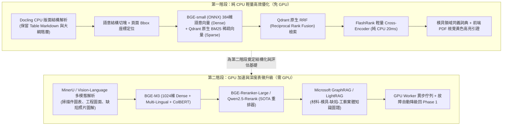

# 19 — 知識庫 RAG 引擎二階段優化需求規格書 (SRS)

版本：1.1 Draft
日期：2026-09-07
狀態：Ready for Planning Review
適用範圍：Mold AI Platform（Web、Platform API、Knowledge Engine、Vector Store、Assistant Gateway）

---

## 1. 文件目的與規劃原則

本規格書針對 Mold AI Platform 目前 Stage 5 的知識庫檢索與增強生成（Knowledge RAG）進行全面重構與升級規劃。

### 1.1 現有版本瓶頸
現行系統採用「`pypdf` 簡單文字抽取 + 64維確定性雜湊向量 + Python 外部詞彙硬性過濾」：
1. **表格打散**：技術規格書與 SOP 內的成型參數對照表被打碎成純字串，失去行列關係。
2. **語意盲區**：無法理解工程同義詞（例如「縮水」↔「凹陷」、「短射」↔「充填不足」）。
3. **過濾嚴苛**：要求查詢詞必須有精確字面覆蓋（`lexical > 0`），容易造成漏檢與過度拒答。

### 1.2 二階段演進原則（先純 CPU 築基，後 GPU 突破）
為兼顧開發節奏、部署成本與高可用性，本規劃嚴格劃分為兩個階段：
* **第一階段（純 CPU / 免 GPU 階段）**：以極高性價比的輕量演算法，重構「解析、分塊、混合檢索、神經重排、領域詞庫與視覺引證」，零新增硬體成本下大幅解決目前 80% 的痛點。
* **第二階段（GPU 加速與深度精準度階段）**：引入 GPU 驅動的「視覺版面大模型、BGE-M3 多向量表徵、SOTA 大參數 Cross-Encoder 重排與 GraphRAG 實體圖譜」，追求工業技術檢索的極致準確度與跨文檔複雜推理。

---

## 2. 二階段架構藍圖

---

## 3. 第一階段詳細規格：純 CPU 輕量高效優化（免 GPU）

### 3.1 核心目標
在不更動伺服器硬體（純 CPU 4~8 核環境）的前提下，將端到端檢索準確率（Recall@5）提升至 85% 以上，並實現完整的表格還原與引證定位。

### 3.2 功能需求清單

#### 1. 結構化文檔解析器（IBM Docling on CPU）
* **技術方案**：整合開源 `docling` 套件，採用 CPU 最佳化模式。
* **解析能力**：
  * 將 PDF、DOCX、XLSX 中的表格精確轉換為標準 Markdown 表格（保留 Header、Row、Column 邏輯）。
  * 識別技術大綱層級（Title、H1、H2、H3、清單、代碼區塊）。
  * 記錄文字區塊在 PDF 頁面上的實體幾何座標 `bbox: [x0, y0, x1, y1]` 與頁碼 `page_no`。
* **Bbox 座標驗證與降級機制**：
  * Chunk 入庫時執行座標合理性檢查：`bbox` 座標不得超出頁面尺寸、寬高不得為 0、`page_no` 必須為正整數。
  * 若 `bbox` 不可用（如掃描件 PDF 或圖形化排版），Chunk 標記為 `bbox_available: false`，前端遞降級為頁碼級引證（僅標示頁碼但不畫框），而非完全失效。

#### 2. 語意感知分塊（Hierarchical & Semantic Chunking）
* 廢棄舊有的 900 字元硬性字串切斷邏輯。
* 規則：
  * **表格完整性保證**：小型表格（$\le 1500$ 字元）作為單一 Chunk 完整保留；大型表格按行切塊並強制附帶表格標題與表頭。
  * **章節上下文聚合**：Chunk 自動攜帶父級章節路徑（如 `成型工藝手冊 > 缺陷排除 > 縮水對策`）。

#### 3. Qdrant 原生雙路混合檢索（Dense + Sparse BM25 + RRF）

> **前置條件：Qdrant 相容性驗證**：`compose.yaml` 目前固定使用 Qdrant `v1.15.4`，版本已高於本方案的最低需求，因此不得再把「升級 Qdrant」列為既定工作。實作前須以鎖定版本驗證 Sparse Vector、Prefetch、RRF、Named Vectors、alias／snapshot 與 rollback 行為；若確實需要變更版本，必須另立 ADR、固定明確版本，完成備份還原與相容性測試，禁止使用 `latest`。

* **Dense 向量**：
  * 引入 `BAAI/bge-small-zh-v1.5`（384 維），使用 ONNX Runtime 於 CPU 執行，推論單句僅需 5~12ms。
  * 徹底取代舊有的 64 維 Blake2b 特徵雜湊，具備真實中英雙語語意泛化能力。
* **Sparse 向量**：
  * 啟用 Qdrant 原生 Sparse 向量索引（BM25 關鍵字模型）。
* **檢索融合**：
  * 廢除在 Python 端手寫的 `_lexical_score` 硬過濾。
  * 改採 Qdrant 原生 **Reciprocal Rank Fusion (RRF)** 演算法，直接在向量庫底層完成語意與字面的加權融合。

**Knowledge Collection 遷移策略（從 64 維升級至 384 維）**：
* 現有 `knowledge-text-demo-v1` Collection 中已索引的 Chunk 使用 64 維 Feature Hash 向量，無法與 384 維 BGE-small 向量共存於同一 Collection。
* **採用方案**：新建 Collection `knowledge-text-v2`（384 維 Dense + Sparse Named Vectors），並提供一次性遷移腳本 `scripts/migrate_knowledge_index_v2.py`：
  1. 遍歷所有現存 `KnowledgeDocument`，使用 Docling 重新解析並以 BGE-small 重新計算向量。
  2. 將新向量與 BM25 Sparse 向量同時寫入 `knowledge-text-v2`。
  3. 遷移期間保留舊 Collection 作為降級備援；完成觀察期、備份還原演練、資料擁有者核准與 audit event 後才能刪除，遷移腳本不得自行刪除舊 Collection。
* 將 `settings.py` 中 `QDRANT_KNOWLEDGE_COLLECTION` 預設值從 `"knowledge-text-demo-v1"` 更新為 `"knowledge-text-v2"`。

#### 4. 純 CPU 級神經重排器（FlashRank Cross-Encoder）
* **技術方案**：引入極輕量重排庫 `flashrank`（模型體積 $< 80\text{MB}$，底層純 ONNX CPU 向量化）。
* **運行方式**：
  * Qdrant 取出 Top-30 候選段落。
  * FlashRank 對 `(Query, Chunk)` 執行交叉注意力評分（Cross-Attention）。
  * 在純 CPU 上耗時僅 20~35ms，輸出精確排序的 Top-5 結果。
* **新版拒答機制（Abstention Mechanism）——取代舊版 `_lexical_score > 0` 硬過濾**：
  * 舊版系統以 `lexical_score <= 0` 作為拒答與防幻覺的核心防線，廢除後必須以等效機制替代。
  * **新規則**：在 FlashRank 重排後使用版本化的拒答門檻 `RERANK_ABSTENTION_THRESHOLD`。門檻不得直接假設為通用 `0.35`，必須以受治理的中英文 Golden QA、文件類型與模型版本校準，保存 precision/recall、誤答成本與核准紀錄。
  * 將所有 `rerank_score < RERANK_ABSTENTION_THRESHOLD` 的候選淘汰。
  * 若淘汰後無任何候選段落，觸發 `abstained = true`，回傳舊版相同的拒答訊息：`"Insufficient authorized evidence was found; no conclusion was generated."`。
  * 此機制確保純 Dense 向量高分但語意不相關的段落無法滲入結果，維持與舊版等效的防幻覺保護。

#### 5. 模具領域專用同義詞擴充（Domain Synonym Expansion）
* 建立射出成型專用詞典，檢索前自動進行 Query 擴展：
  * `縮水` ↔ `凹痕` ↔ `收縮凹陷` ↔ `Sink Mark`
  * `短射` ↔ `欠注` ↔ `充填不足` ↔ `Short Shot`
  * `結合線` ↔ `熔接線` ↔ `夾水紋` ↔ `Weld Line`
  * `頂白` ↔ `頂針發白` ↔ `頂出應力痕` ↔ `Stress Mark`

#### 6. 前端 PDF 視覺黃色高亮引證（Bounding-box Citations）
* 前端基於 PDF.js 實現查看器組件。
* 使用者在 AI 助理對話中點擊引用標籤 `[Citation #1]`，右側自動彈出來源 PDF，並精確翻頁至對應位置，以半透明黃色方框高亮被引用的段落。
* **Bbox 不可用時的降級行為**：若 Chunk 標記為 `bbox_available: false`，前端僅執行頁碼級導航（翻至該頁），不畫黃色框，避免座標失準造成誤導。

#### 7. Embedding 模型離線部署策略（Offline Model Packaging）
* 生產環境（模具廠內網）通常無法連接外網下載 HuggingFace 模型，必須預先打包。
* **方案**：
  * 提供 `scripts/download_models.py` 腳本，在有網路的環境中預先下載 BGE-small ONNX 模型（約 90MB）與 FlashRank 模型（約 80MB）。
  * CI/CD 流程中將模型檔打入 Docker Image 的 `/app/models/` 目錄。
  * `settings.py` 中新增配置項：
    * `EMBEDDING_MODEL_PATH = os.getenv("EMBEDDING_MODEL_PATH", "/app/models/bge-small-zh-v1.5-onnx")`
    * `RERANKER_MODEL_PATH = os.getenv("RERANKER_MODEL_PATH", "/app/models/flashrank")`
  * 應用啟動時檢查模型路徑是否存在，若缺失則拋出明確錯誤訊息（包含下載指令提示）。

---

## 4. 第二階段詳細規格：GPU 加速與深度表徵升級（需 GPU）

### 4.1 核心目標
引入 GPU 運算資源，解決複雜掃描件/圖紙理解難題，透過 SOTA 大維度嵌入與實體知識圖譜，實現跨文檔多跳推理與近乎 0 幻覺的專業技術解答。

### 4.2 功能需求清單

#### 1. 視覺多模態版面解析器（MinerU / Vision-Language Parsing）
* **適用對象**：老舊掃描件 PDF、含有手寫標籤的試模報告、包含缺陷照片（流痕、銀絲）的技術圖解。
* **技術方案**：
  * 使用 OpenDataLab **MinerU** 或多模態視覺模型（如 Qwen2-VL / Surya）。
  * 利用 GPU 進行高解析度影像特徵提取，將圖表、照片說明文字、數學公式精準轉化為高質量 Markdown。

#### 2. SOTA 大維度多語系多向量表徵（BGE-M3 on GPU）
* **技術方案**：部署 **BGE-M3**（1024 維）。
* **核心優勢**：
  * 同步產出 **Dense**（高維語意）、**Sparse**（跨語系詞彙权重）與 **Multi-Vector ColBERT**（Token 級遲延交互向量）。
  * 支援長達 8,192 Tokens 的超長上下文輸入。
  * 對於包含大量料號、國際標準（如 ISO 294、ASTM D955）的技術文檔具備極強的檢索辨識力。

#### 3. 巨量參數神經重排器（BGE-Reranker-Large / Qwen2.5-Rerank）
* **技術方案**：部署參數規模達數億至數十億的重排模型。
* **核心能力**：
  * 具備深層邏輯推理能力，能辨別文檔中細微的限制條件（例如：「料溫 220℃ 僅適用於乾燥 4 小時後」）。
  * GPU 推論時間：Top-50 候選打分約 30~60ms。

#### 4. 模具知識圖譜增強（GraphRAG / LightRAG）
* **技術方案**：建構專屬模具領域知識圖譜。
* **流程**：
  1. 利用 GPU 加速本地大語言模型（如 Qwen-2.5-32B），離線抽取所有知識文檔中的實體：
     * **實體**：`材料 (Material)`、`模具部件 (Part)`、`成型缺陷 (Defect)`、`機台參數 (Parameter)`、`對策 (Action)`。
     * **關聯**：`造成 (Causes)`、`解決 (Resolves)`、`適用於 (AppliesTo)`。
  2. 建立 NetworkX / Neo4j 拓撲圖結構。
  3. **檢索模式**：當使用者詢問宏觀問題（如：「哪些材料在薄壁射出時最容易發生短射，常用的模具結構改善方案有哪些？」）時，系統能跨 10 份不同文檔進行社群摘要（Community Summarization）綜合回答。

#### 5. 算力解耦與自動優雅降級機制（Fault-Tolerant Fallback）
* GPU 任務統一註冊於 Celery 佇列：`queue: "gpu"`，並以 `resource_class: "gpu_knowledge"` 細分任務類型。此佇列命名與 SRS 18（CAD 相似度優化）統一，確保 GPU 硬體資源共享調度：
  * `resource_class: "gpu_cad"` 用於 CAD 深度幾何表徵（見 SRS 18 Phase 5）。
  * `resource_class: "gpu_knowledge"` 用於 RAG 深度嵌入與重排。
* 系統定期進行 GPU 節點心跳檢查（Heartbeat）。
* **降級保護**：當 GPU 節點逾時、過載或離線時，由具 timeout、circuit breaker、idempotency 與 queue cancellation 的狀態機切換回 Phase 1 CPU 流程。切換時間以實測 p95 SLO 定義，不宣稱未驗證的毫秒級或永不中斷；前端須顯示 `degraded`、重試狀態與實際使用的 parser/embedding/reranker 版本。

---

## 5. 兩階段技術規格與效益對比

| 維度 | 現有版本 (Stage 5 Baseline) | 第一階段 (純 CPU 優化) | 第二階段 (GPU 加速與深度表徵) |
|---|---|---|---|
| **文檔解析器** | `pypdf` 純文字擷取 | **IBM Docling (CPU)** | **MinerU / 多模態視覺解析 (GPU)** |
| **表格辨識能力** | ❌ 丟失，打散成字串 | ✅ **Markdown 表格保留** | ✅ **表格 + 圖表圖解全理解** |
| **向量嵌入維度** | 64維 Blake2b 特徵雜湊 | **384維 BGE-small (ONNX)** | **1024維 BGE-M3 (Dense+ColBERT)** |
| **關鍵字檢索** | Python 手寫覆蓋率 | **Qdrant 原生 BM25 + RRF** | **BGE-M3 Sparse + ColBERT** |
| **重排器 (Rerank)** | 4 軌手寫經驗公式 | **FlashRank (ONNX CPU, ~25ms)** | **BGE-Reranker-Large (GPU, ~40ms)** |
| **實體圖譜支援** | ❌ 無 | ❌ 無（領域同義詞擴充） | ✅ **GraphRAG 跨文檔多跳推理** |
| **引證定位精度** | 段落字元估算 | ✅ **PDF 頁碼 + 幾何 Bbox 黃框** | ✅ **頁碼 + Bbox + 截圖圖解** |
| **硬體需求** | 一般 CPU | 一般 4~8 核 CPU (無需 GPU) | 需 1 塊 NVIDIA GPU (顯存 $\ge 16\text{GB}$) |
| **Recall@5 預估** | ~58% | **85% ~ 90%** | **94% ~ 98%** |
| **查詢端到端延遲** | ~80ms | **120ms ~ 200ms** | **200ms ~ 350ms** |

---

## 6. 測試驗收與品質指標

### 6.1 RAG 三大黃金評估標準（基於 Ragas 框架）
建立包含 100 組模具成型規範與 SOP 的標準問答測試集（Golden QA Dataset），量測指標：
1. **Context Precision（檢索精確度）**：檢索出的段落中與問題相關的比例（目標：Phase 1 $\ge 85\%$；Phase 2 $\ge 93\%$）。
2. **Context Recall（檢索召回率）**：標準答案所需事實被成功檢索出的比例（目標：Phase 1 $\ge 82\%$；Phase 2 $\ge 95\%$）。
3. **Faithfulness（真實度/防幻覺指標）**：生成回答中能夠被引用依據完全支撐的比例（目標：兩階段皆必須 $\ge 98\%$）。

### 6.2 實施時程規劃
* **Phase 1（純 CPU 優化）**：預估工期 **4 週**（Qdrant 升級 + Collection 遷移 0.5 週 + Docling 解析 1 週 + 向量與 Qdrant RRF 1 週 + FlashRank 重排與拒答機制 0.5 週 + 前端 Bbox 高亮 1 週）。
* **Phase 2（GPU 深度升級）**：預估工期 **4 週**（GPU 佇列架構 1 週 + BGE-M3/Reranker 整合 1 週 + GraphRAG 實體圖譜構建 1.5 週 + 降級測試 0.5 週）。

---

## 7. 實作就緒補充要求（Review Gate）

### 7.1 授權檢索與資料生命週期

- **RAG-GOV-001**：Dense prefetch、Sparse prefetch、RRF、rerank、citation、Graph traversal、cache 與 Assistant prompt 的每一階段都必須使用伺服器依身分導出的 scope/classification/project/customer ACL；未授權 Chunk 不得成為候選、日誌內容或分數統計的一部分。
- **RAG-GOV-002**：Qdrant payload 至少保存 `document_id`、`document_version_id`、`chunk_id`、scope、classification、publication/lifecycle status、parser/chunker/embedding version 與 source checksum。文件退役、撤回、重新發布或 ACL 變更時必須以可核對 Job 更新或 tombstone 所有 Dense/Sparse/Graph 衍生資料。
- **RAG-GOV-003**：檢索結果回傳前再次執行授權與 publication status 驗證，避免索引更新延遲造成舊權限資料外洩。

### 7.2 不受信任文件與解析安全

- **RAG-SEC-001**：文件內容一律視為不受信任資料；解析出的指令、Prompt、連結、程式碼、表格或 metadata 不得改變 System/Developer policy、呼叫工具或擴張資料範圍。生成階段須保留引用、拒答與 tool allowlist。
- **RAG-SEC-002**：沿用現有上傳安全管線的加密檔、macro、外部連結與 MIME/signature 檢查，並為 Docling/MinerU/PDF.js 設定 sandbox、無預設網路 egress、檔案／頁數／解壓倍率、CPU、RAM、GPU 與執行時間上限；超限進入 quarantine 並產生 typed error。
- **RAG-SEC-003**：PDF.js 只可透過需授權的同源下載端點取得來源，使用 CSP、Range request 與短效權杖；bbox/citation 不得包含未授權頁面文字或可推導的檔名／路徑。

### 7.3 Chunk、Citation 與模型契約

- **RAG-CDM-001**：Chunk Contract 必須定義文字、語言、標題路徑、table context、page number、頁面寬高、bbox 座標原點／單位／旋轉、`bbox_available`、source offsets、parser/chunker version 與 checksum；前端只依版本化契約畫框。
- **RAG-CDM-002**：Named dense/sparse vectors 必須明確定義名稱、維度、distance、tokenizer/sparse encoder、模型 revision 與 normalization。索引 manifest checksum 必須隨結果與 Lineage 保存。
- **RAG-CDM-003**：所有 embedding、reranker、parser、OCR/VLM 與 Graph 模型需保存來源、授權、版本、SHA-256、SBOM/CVE、核准人與 RAM/VRAM/磁碟需求；CI 只從 allowlist 下載，Runtime 禁止外網下載，並維持單一 `mold-ai-platform-app:<version>` 應用映像契約。

### 7.4 Collection 遷移與運行恢復

- **RAG-MIG-001**：重建 Job 必須可重入、可續跑、可取消，以 document version + pipeline manifest checksum 去重，保存成功／失敗／隔離／跳過數量與逐筆原因。
- **RAG-MIG-002**：先建立 staging collection，完成來源數、Chunk 數、ACL 分布、checksum、向量 schema、隨機引用與 Golden QA 核對，再以 alias／等效原子路由切換；Shadow read 不得把 v1/v2 未校準分數直接混排。
- **RAG-MIG-003**：切換後保留 v1 觀察期並演練一次回滾。索引、資料庫 publication state 與物件儲存不一致時，以資料庫受治理版本為準並拒絕回傳可疑 evidence。

### 7.5 評估、拒答與 Definition of Done

- **RAG-ACC-001**：Golden QA 必須版本化並涵蓋繁中、英文、雙語查詢、表格、掃描件、無答案、相似但不適用、ACL 否定與 prompt-injection 文件；門檻依模型/pipeline version 校準，變更需重新核准。
- **RAG-ACC-002**：Ragas 或其他評估器如需 LLM，須明確指定本機／外部 evaluator、資料是否可外送、成本與版本；高風險錯答由至少兩名工程審查者裁決並保存 disagreement。
- **RAG-ACC-003**：效能報告列出硬體、模型、語料量、Chunk 數、冷／熱快取、併發數、queue backlog、p50/p95、拒答率及各文件類型指標。文件中的延遲、Recall 與 Faithfulness 均為初始目標，不是產品保證。
- **RAG-ACC-004**：Phase Gate 必須通過 parser sandbox、ACL 否定、索引 tombstone、遷移續跑、原子回滾、模型缺失、GPU 故障注入、引用座標與來源授權測試；任何未授權 evidence 洩漏或無法回滾皆阻擋發布。
