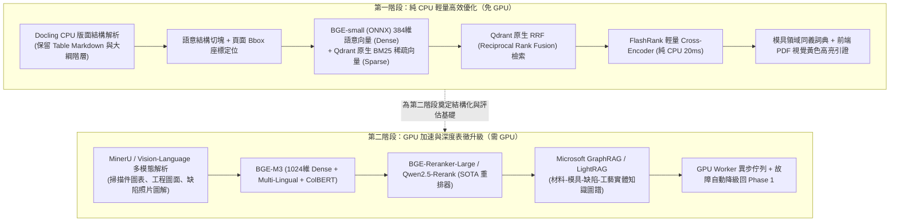

# 19 — 知識庫 RAG 引擎二階段優化需求規格書 (SRS)

版本：1.0 Draft  
日期：2026-09-04  
狀態：Approved for Planning  
適用範圍：Mold AI Platform（Web、Platform API、Knowledge Engine、Vector Store、Assistant Gateway）

---

## 1. 文件目的與規劃原則

本規格書針對 Mold AI Platform 目前 Stage 5 的知識庫檢索與增強生成（Knowledge RAG）進行全面重構與升級規劃。

### 1.1 現有版本瓶頸
現行系統採用「`pypdf` 簡單文字抽取 + 64維確定性雜湊向量 + Python 外部詞彙硬性過濾」：
1. **表格打散**：技術規格書與 SOP 內的成型參數對照表被打碎成純字串，失去行列關係。
2. **語意盲區**：無法理解工程同義詞（例如「縮水」↔「凹陷」、「短射」↔「充填不足」）。
3. **過濾嚴苛**：要求查詢詞必須有精確字面覆蓋（`lexical > 0`），容易造成漏檢與過度拒答。

### 1.2 二階段演進原則（先純 CPU 築基，後 GPU 突破）
為兼顧開發節奏、部署成本與高可用性，本規劃嚴格劃分為兩個階段：
* **第一階段（純 CPU / 免 GPU 階段）**：以極高性價比的輕量演算法，重構「解析、分塊、混合檢索、神經重排、領域詞庫與視覺引證」，零新增硬體成本下大幅解決目前 80% 的痛點。
* **第二階段（GPU 加速與深度精準度階段）**：引入 GPU 驅動的「視覺版面大模型、BGE-M3 多向量表徵、SOTA 大參數 Cross-Encoder 重排與 GraphRAG 實體圖譜」，追求工業技術檢索的極致準確度與跨文檔複雜推理。

---

## 2. 二階段架構藍圖

---

## 3. 第一階段詳細規格：純 CPU 輕量高效優化（免 GPU）

### 3.1 核心目標
在不更動伺服器硬體（純 CPU 4~8 核環境）的前提下，將端到端檢索準確率（Recall@5）提升至 85% 以上，並實現完整的表格還原與引證定位。

### 3.2 功能需求清單

#### 1. 結構化文檔解析器（IBM Docling on CPU）
* **技術方案**：整合開源 `docling` 套件，採用 CPU 最佳化模式。
* **解析能力**：
  * 將 PDF、DOCX、XLSX 中的表格精確轉換為標準 Markdown 表格（保留 Header、Row、Column 邏輯）。
  * 識別技術大綱層級（Title、H1、H2、H3、清單、代碼區塊）。
  * 記錄文字區塊在 PDF 頁面上的實體幾何座標 `bbox: [x0, y0, x1, y1]` 與頁碼 `page_no`。

#### 2. 語意感知分塊（Hierarchical & Semantic Chunking）
* 廢棄舊有的 900 字元硬性字串切斷邏輯。
* 規則：
  * **表格完整性保證**：小型表格（$\le 1500$ 字元）作為單一 Chunk 完整保留；大型表格按行切塊並強制附帶表格標題與表頭。
  * **章節上下文聚合**：Chunk 自動攜帶父級章節路徑（如 `成型工藝手冊 > 缺陷排除 > 縮水對策`）。

#### 3. Qdrant 原生雙路混合檢索（Dense + Sparse BM25 + RRF）
* **Dense 向量**：
  * 引入 `BAAI/bge-small-zh-v1.5`（384 維），使用 ONNX Runtime 於 CPU 執行，推論單句僅需 5~12ms。
  * 徹底取代舊有的 64 維 Blake2b 特徵雜湊，具備真實中英雙語語意泛化能力。
* **Sparse 向量**：
  * 啟用 Qdrant 原生 Sparse 向量索引（BM25 關鍵字模型）。
* **檢索融合**：
  * 廢除在 Python 端手寫的 `_lexical_score` 硬過濾。
  * 改採 Qdrant 原生 **Reciprocal Rank Fusion (RRF)** 演算法，直接在向量庫底層完成語意與字面的加權融合。

#### 4. 純 CPU 級神經重排器（FlashRank Cross-Encoder）
* **技術方案**：引入極輕量重排庫 `flashrank`（模型體積 $< 80\text{MB}$，底層純 ONNX CPU 向量化）。
* **運行方式**：
  * Qdrant 取出 Top-30 候選段落。
  * FlashRank 對 `(Query, Chunk)` 執行交叉注意力評分（Cross-Attention）。
  * 在純 CPU 上耗時僅 20~35ms，輸出精確排序的 Top-5 結果。

#### 5. 模具領域專用同義詞擴充（Domain Synonym Expansion）
* 建立射出成型專用詞典，檢索前自動進行 Query 擴展：
  * `縮水` ↔ `凹痕` ↔ `收縮凹陷` ↔ `Sink Mark`
  * `短射` ↔ `欠注` ↔ `充填不足` ↔ `Short Shot`
  * `結合線` ↔ `熔接線` ↔ `夾水紋` ↔ `Weld Line`
  * `頂白` ↔ `頂針發白` ↔ `頂出應力痕` ↔ `Stress Mark`

#### 6. 前端 PDF 視覺黃色高亮引證（Bounding-box Citations）
* 前端基於 PDF.js 實現查看器組件。
* 使用者在 AI 助理對話中點擊引用標籤 `[Citation #1]`，右側自動彈出來源 PDF，並精確翻頁至對應位置，以半透明黃色方框高亮被引用的段落。

---

## 4. 第二階段詳細規格：GPU 加速與深度表徵升級（需 GPU）

### 4.1 核心目標
引入 GPU 運算資源，解決複雜掃描件/圖紙理解難題，透過 SOTA 大維度嵌入與實體知識圖譜，實現跨文檔多跳推理與近乎 0 幻覺的專業技術解答。

### 4.2 功能需求清單

#### 1. 視覺多模態版面解析器（MinerU / Vision-Language Parsing）
* **適用對象**：老舊掃描件 PDF、含有手寫標籤的試模報告、包含缺陷照片（流痕、銀絲）的技術圖解。
* **技術方案**：
  * 使用 OpenDataLab **MinerU** 或多模態視覺模型（如 Qwen2-VL / Surya）。
  * 利用 GPU 進行高解析度影像特徵提取，將圖表、照片說明文字、數學公式精準轉化為高質量 Markdown。

#### 2. SOTA 大維度多語系多向量表徵（BGE-M3 on GPU）
* **技術方案**：部署 **BGE-M3**（1024 維）。
* **核心優勢**：
  * 同步產出 **Dense**（高維語意）、**Sparse**（跨語系詞彙权重）與 **Multi-Vector ColBERT**（Token 級遲延交互向量）。
  * 支援長達 8,192 Tokens 的超長上下文輸入。
  * 對於包含大量料號、國際標準（如 ISO 294、ASTM D955）的技術文檔具備極強的檢索辨識力。

#### 3. 巨量參數神經重排器（BGE-Reranker-Large / Qwen2.5-Rerank）
* **技術方案**：部署參數規模達數億至數十億的重排模型。
* **核心能力**：
  * 具備深層邏輯推理能力，能辨別文檔中細微的限制條件（例如：「料溫 220℃ 僅適用於乾燥 4 小時後」）。
  * GPU 推論時間：Top-50 候選打分約 30~60ms。

#### 4. 模具知識圖譜增強（GraphRAG / LightRAG）
* **技術方案**：建構專屬模具領域知識圖譜。
* **流程**：
  1. 利用 GPU 加速本地大語言模型（如 Qwen-2.5-32B），離線抽取所有知識文檔中的實體：
     * **實體**：`材料 (Material)`、`模具部件 (Part)`、`成型缺陷 (Defect)`、`機台參數 (Parameter)`、`對策 (Action)`。
     * **關聯**：`造成 (Causes)`、`解決 (Resolves)`、`適用於 (AppliesTo)`。
  2. 建立 NetworkX / Neo4j 拓撲圖結構。
  3. **檢索模式**：當使用者詢問宏觀問題（如：「哪些材料在薄壁射出時最容易發生短射，常用的模具結構改善方案有哪些？」）時，系統能跨 10 份不同文檔進行社群摘要（Community Summarization）綜合回答。

#### 5. 算力解耦與自動優雅降級機制（Fault-Tolerant Fallback）
* GPU 任務統一註冊於 Celery 佇列：`queue: "gpu_knowledge"`。
* 系統定期進行 GPU 節點心跳檢查（Heartbeat）。
* **降級保護**：當 GPU 節點過載或離線時，系統**毫秒級自動切換回 Phase 1 的 CPU 檢索流程（Docling + bge-small + FlashRank）**，確保前端業務永不中斷。

---

## 5. 兩階段技術規格與效益對比

| 維度 | 現有版本 (Stage 5 Baseline) | 第一階段 (純 CPU 優化) | 第二階段 (GPU 加速與深度表徵) |
|---|---|---|---|
| **文檔解析器** | `pypdf` 純文字擷取 | **IBM Docling (CPU)** | **MinerU / 多模態視覺解析 (GPU)** |
| **表格辨識能力** | ❌ 丟失，打散成字串 | ✅ **Markdown 表格保留** | ✅ **表格 + 圖表圖解全理解** |
| **向量嵌入維度** | 64維 Blake2b 特徵雜湊 | **384維 BGE-small (ONNX)** | **1024維 BGE-M3 (Dense+ColBERT)** |
| **關鍵字檢索** | Python 手寫覆蓋率 | **Qdrant 原生 BM25 + RRF** | **BGE-M3 Sparse + ColBERT** |
| **重排器 (Rerank)** | 4 軌手寫經驗公式 | **FlashRank (ONNX CPU, ~25ms)** | **BGE-Reranker-Large (GPU, ~40ms)** |
| **實體圖譜支援** | ❌ 無 | ❌ 無（領域同義詞擴充） | ✅ **GraphRAG 跨文檔多跳推理** |
| **引證定位精度** | 段落字元估算 | ✅ **PDF 頁碼 + 幾何 Bbox 黃框** | ✅ **頁碼 + Bbox + 截圖圖解** |
| **硬體需求** | 一般 CPU | 一般 4~8 核 CPU (無需 GPU) | 需 1 塊 NVIDIA GPU (顯存 $\ge 16\text{GB}$) |
| **Recall@5 預估** | ~58% | **85% ~ 90%** | **94% ~ 98%** |
| **查詢端到端延遲** | ~80ms | **120ms ~ 200ms** | **200ms ~ 350ms** |

---

## 6. 測試驗收與品質指標

### 6.1 RAG 三大黃金評估標準（基於 Ragas 框架）
建立包含 100 組模具成型規範與 SOP 的標準問答測試集（Golden QA Dataset），量測指標：
1. **Context Precision（檢索精確度）**：檢索出的段落中與問題相關的比例（目標：Phase 1 $\ge 85\%$；Phase 2 $\ge 93\%$）。
2. **Context Recall（檢索召回率）**：標準答案所需事實被成功檢索出的比例（目標：Phase 1 $\ge 82\%$；Phase 2 $\ge 95\%$）。
3. **Faithfulness（真實度/防幻覺指標）**：生成回答中能夠被引用依據完全支撐的比例（目標：兩階段皆必須 $\ge 98\%$）。

### 6.2 實施時程規劃
* **Phase 1（純 CPU 優化）**：預估工期 **3.5 週**（Docling 解析 1 週 + 向量與 Qdrant RRF 1 週 + FlashRank 重排 0.5 週 + 前端 Bbox 高亮 1 週）。
* **Phase 2（GPU 深度升級）**：預估工期 **4 週**（GPU 佇列架構 1 週 + BGE-M3/Reranker 整合 1 週 + GraphRAG 實體圖譜構建 1.5 週 + 降級測試 0.5 週）。
